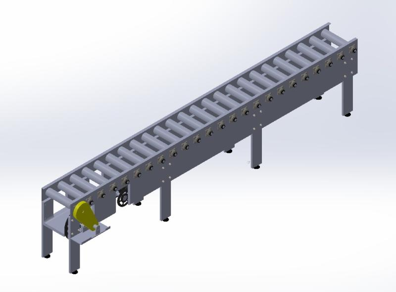

# Chain-Roller Conveyor Design

## Description
For the Engineering Design II (EDPT602) course, the project involved designing a fully functional chain-roller conveyor system. The objective was to create a conveyor capable of efficiently transporting 25kg boxes (300mm x 300mm x 300mm). The design included a conveyor chassis, motor, V-Belt drive, gearbox, rollers interconnected by chains, and bearing blocks.

To meet the specifications, the conveyor had a length of 6000mm, rollers spaced 250mm apart, linear velocity of 0.5 m/s, roller diameter of 100-150mm, and 200mm distance between boxes. The design process encompassed chassis design, motor selection, V-Belt drive design, single-stage gearbox design, chain drive selection, bearing selection, material selection, CAD modeling, and assembly drawings.

Design considerations included structural integrity, load-bearing capacity, and ease of assembly. A motor was chosen based on input power and RPM requirements, attached optimally to the chassis. A V-Belt drive efficiently transmitted power from the motor to the gearbox. The single-stage gearbox facilitated power transmission to the driving roller via a chain mechanism.

Each roller was connected to the following roller using a chain drive, ensuring reliable power transmission. Bearing blocks connected the rollers to the chassis, selected for load-bearing capacity and smooth rotation from the SKF Bearing Catalouge.

Project deliverables included motor power calculations, V-Belt drive design, gearbox design, chain drive selection, bearing selection, material selection, CAD modeling, and assembly drawings.

All calculations and component selections were done theoretically by hand and the 2D and 3D CAD models were modeled on Solidworks

## Project Report
Feel free to read a detail [report](Report.pdf) covering the analysis and all material selection calculations

Also, a video showcasing its operation is found [here](https://youtu.be/TqIwfJTP_P4)