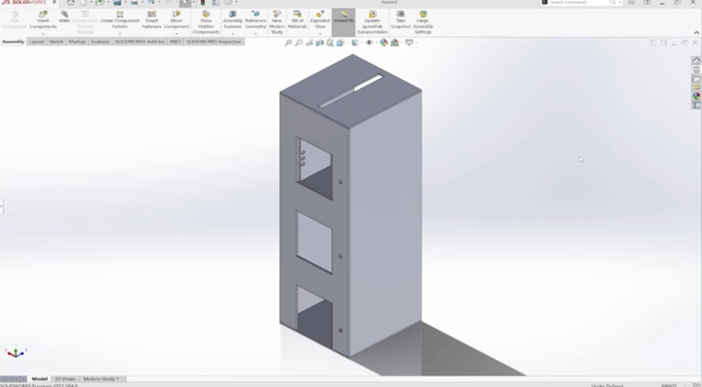

# Three Floor Elevator Model

## Description
For the Digital System Design (ELCT501) course, the project involved designing a 3-floor elevator model capable of supporting a minimum weight of 0.5kg. The model's control system utilized a Basys3 FPGA, with the controller code written in VHDL using Xilinx Vivado. The project encompassed multiple stages, starting with the development of a cardboard prototype, which was later refined and modeled in Solidworks. 

The elevator model was constructed using wood and incorporated a DC motor for the lifting mechanism. The elevator cabin featured push buttons both inside and outside, allowing users to call the elevator to their desired floor. IR sensors were employed to accurately detect the floor that the cabin reached during operation.

A crucial component of the project was the integration of a DC motor driver, responsible for translating the FPGA signal into motor voltage. This arrangement facilitated precise and efficient control over the elevator's movements, ensuring smooth transitions between floors.

The project represents a notable achievement in digital system design, as it combined advanced technologies and innovative design concepts. By utilizing the Basys3 FPGA and VHDL programming, a high level of control and automation in the elevator model was achieved. The integration of IR sensors enhanced the safety and accuracy of floor detection, contributing to the overall reliability of the system.

Overall, this project showcases the successful implementation of digital system design principles in creating a highly functional and reliable 3-floor elevator model. The integration of advanced technologies, precise control mechanisms, and innovative design elements demonstrates a comprehensive understanding of digital systems and their practical applications.

