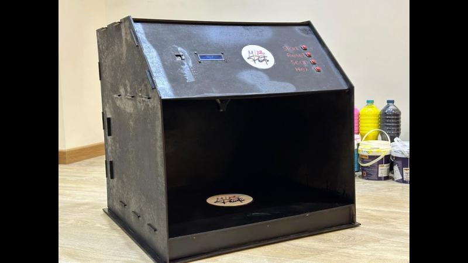

# Automated Paint Mixing Machine Using PID Control

## Description
For the Mechatronics Engineering course (MCTR601), the project involved the design and implementation of a paint mixing machine based on the CMYK color model. The primary objective was to create a machine capable of accurately mixing pigments using PID control to achieve desired colors for various paint materials.

Solidworks modeling was utilized to create a comprehensive design of the machine. Then through prototyping, design flaws were identified and necessary were made, ensuring an efficient and functional machine.

Digital control implementation was a key aspect of the project. The system was modeled on Simulink, and a transfer function was derived and discretized to obtain the PID gains needed for accurate paint mixing. 

FreeRTOS on Arduino Mega 2650 was chosen as the real-time operating system to ensure effective multitasking and efficient processor utilization, facilitating precise paint mixing and timely responses.

PID controller tuning played a crucial role in optimizing the machine's accuracy. By fine-tuning the controllers, better control over the mixing process was achieved, resulting in improved color matching outcomes.

A windows app was developed using Windows Forms App (C#) in Visual Studio to communicate with the Arduino serially to send HEX codes to the machine. A user friendly GUI was created to boost the overall user experience.

The final phase of the project encompassed the development of the complete model. This included the installation of hardware components, integration of the control system, and comprehensive testing and tuning of the entire system. These steps ensured the accuracy of the paint mixing machine.

This project exemplifies proficiency in mechatronics engineering, embedded systems, control theory, and real-time operating systems. The systematic approach, encompassing design, prototyping, testing, and control implementation, highlights the ability to tackle real-world challenges and deliver innovative engineering solutions.

## Project Report & Video
Feel free to read a detail [report](Report.pdf) covering the analysis and all material selection calculations

Also, a video showcasing its operation is found [here](https://www.youtube.com/watch?v=Q1ZANpf9rc4)