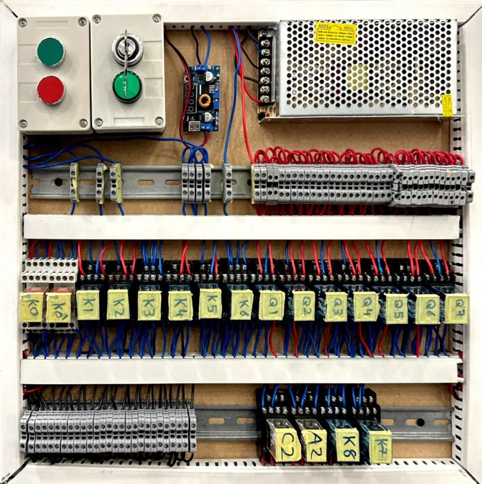

# Pneumatic Metal Separator Machine

## Description
For the Mechatronics Lab Course (MCTR704), the project involves the design and implementation of a metal separator using pneumatic cylinders. The project received bonus grades for completing it in a standard quality.

The machine designed with a frame structure design and modelled on Solidworks along with an exploded view for easy identification of all necessary components.

The control circuit of the pneumatic circuit was designed and simulated on Fluidsim as built to ensure smooth operation of the control circuit. The circuit was then built by hand to control and operate the machine.

The following is the operation sequence of the machine: 
Upon detecting metal with the sensor attached to the separation box's base, the vertical cylinders extend, activating the electromagnet to collect metals from the separation box before retracting. The horizontal cylinder then retracts, pulling the vertical cylinder towards the collection box. 
The vertical cylinder extends to release the metal and retract followed by the extension of the horizontal cylinder to return to initial position. This operation is continuous as long as the metal sensor detects presence of metal in the box. Upon separating the metals, the third cylinder retracts opening a sliding door to drop the non metals in another collection box.

This project showcases proficiency in mechatronics engineering, classical control theory, circuits building and simulation, mechanical design and pneumatics.

## Project Report & Video
Feel free to read a detail [report](Report.pdf) covering the analysis and all material selection calculations

Also, a video showcasing its operation is found [here](https://www.youtube.com/watch?v=JfKoVaeNIGY)