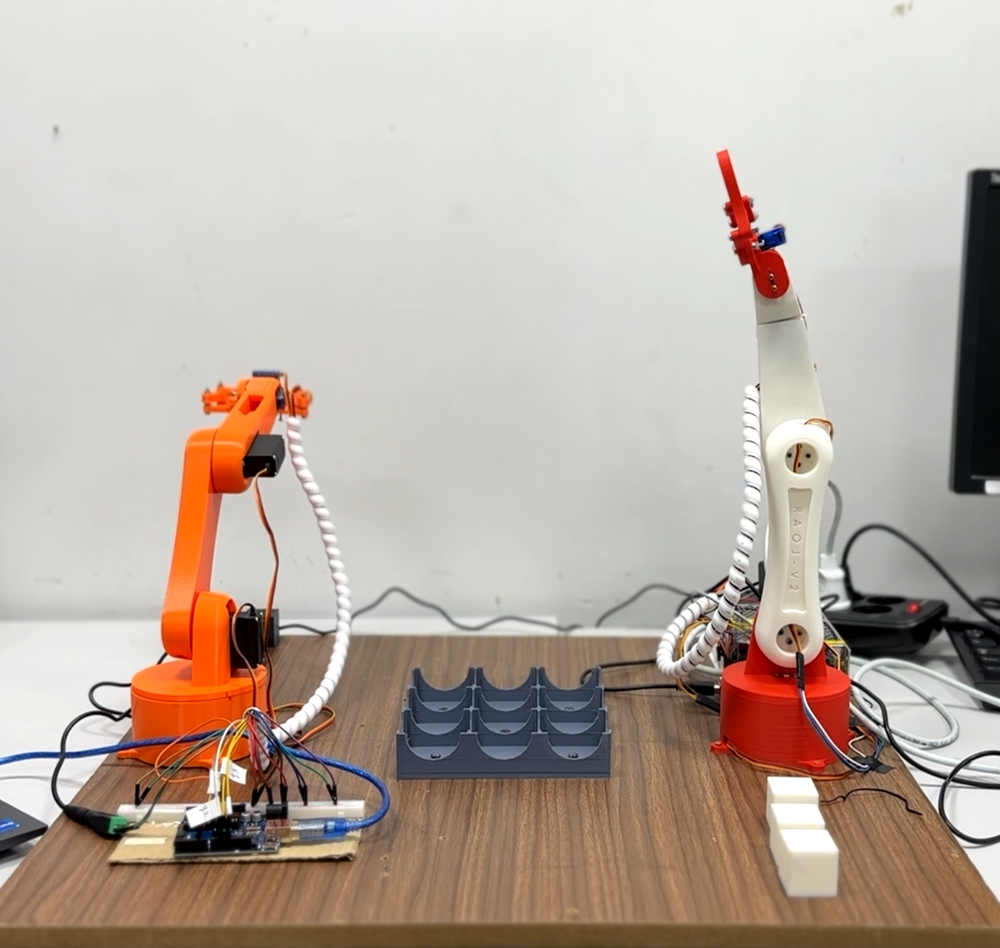

# 4-DOF Robotic Arm Fabrication

## Description
As of the Robotics Pre-Masters course at The German University in Cairo, I had the opportunity to design and manufacture a desktop industrial robotic arm from scratch. The robot’s body was 3D printed, assembled, and developed to perform pick and place applications with precision and efficiency.

To further enhance the functionality of the robotic arm, a digital twin was developed using MATLAB Simscape and CoppeliaSim. This enabled us to conduct simulations, testing various operational scenarios to optimize performance.

Using forward kinematics, inverse kinematics, and joint space trajectory generation, we successfully programmed the robotic arm to perform complex pick-and-place tasks with precision.

Furthermore, we demonstrated the robot’s ability to cooperate with another robot by playing a tic-tac-toe game. This cooperation showcased the robot’s potential for interactive and cooperative tasks in real-world industrial applications.

## Project Report & Video
Feel free to read a detail [report](Report.pdf) covering the analysis and all material selection calculations

Also, a video showcasing its operation is found [here](https://youtu.be/JVwynrWV-ZU)